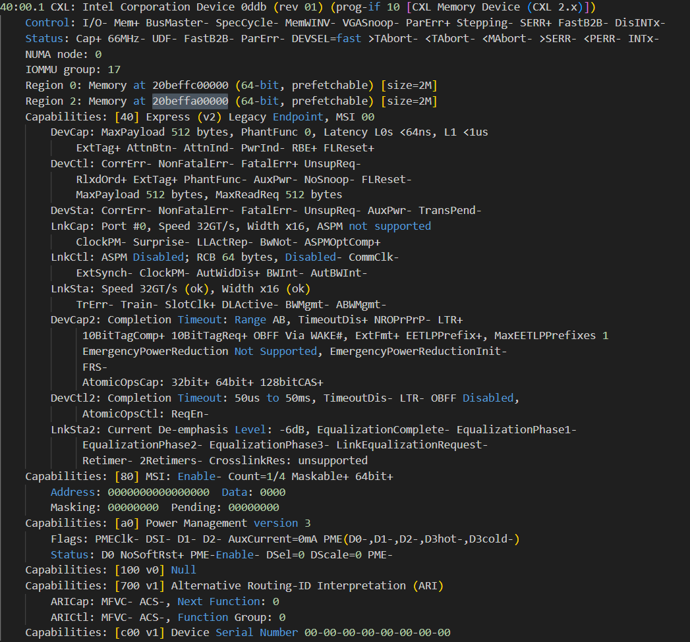
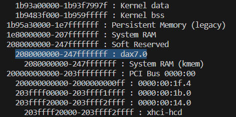

# NeoMem-MICRO-2024

The Artifact of  NeoMem: Hardware/Software Co-Design for CXL-Native Memory Tiering. This project is developed on Intel's CXL FPGA platform

## Overview

[1. Introduction](#1-introduction)

[2. Hardware Requirements](#2-hardware-and-software-requirements)

[3. Installation](#3-installation)

[4. Run Experiments](#4-run-experiments)

[5. Check Results](#5-check-results)

## 1. Introduction

NeoMem project consists of three submodules: [NeoMem_FPGA](), [linux]() and [experiments](). `NeoMem_FPGA` contains the FPGA code of NeoProf. The `linux` folder contains NeoMem's host-side driver, daemon and user-space interface implementation. You can find some click-to-run scripts in the `NeoMem_benchmarking` folder, which helps you reproduce the main results of NeoMem paper.

## 2. Hardware and Software Requirements
<a name="2-system_setup"></a>

Here are the hardware and software setups used in NeoMem:

1. Supermicro SYS-741GE-TNRT platform
2. Intel Agilex-7 I series FPGA Dev Kit @400Mhz
3. 32GB DDR5 4800Mhz DRAM x4
4. Single Socket Xeon 4th 6430 CPU @ 2.1GHz
5. Quartus 22.3 with CXL 1.1 IP

## 3. Installation

To download this repo, run:
```sh
git clone git@github.com:PKUZHOU/NeoMem-MICRO-2024.git
cd NeoMem-MICRO-2024
git submodule update --init
```

To install the provided linux kernel, run:
```sh
cd linux
make -j
make modules_install
make install
```

Note that we hardcode some address in our driver (in _linux/drivers/neoprof/neoprof.c_), you may need to change it on your platform. 

*NEOPROFILER_MMIO_BASE* defines the start address of the BAR space of the CXL-enabled FPGA device. To find the address on your platform, run:
```sh
lspci -vvv
```
You can find the address as follows.



*CXL_MEM_BASE* defines the start memory address of the CXL-enabled FPGA device. To find the address on your platform, run:
```sh
cat /proc/iomem
```
The CXL memory device is detected as a DAX device. You can find the address as follows.



## 4. Run Experiments

To get the result shown in Fig.11 and Fig.13, run

```sh
cd NeoMem_benchmarking
python run_all.py
```

The experiment result will be stored in *output/experiment_output*

To get the result shown in Fig.16, run

```sh
python run_convergence_curve.py
```

The experiment result will be stored in *output/gups_convergence_analysis*

## 5. Check Results

To visualize the experiment result, run

```sh
cd NeoMem_benchmarking
python parse_result.py
```

The result figure will be stored in *output/fig_output*
